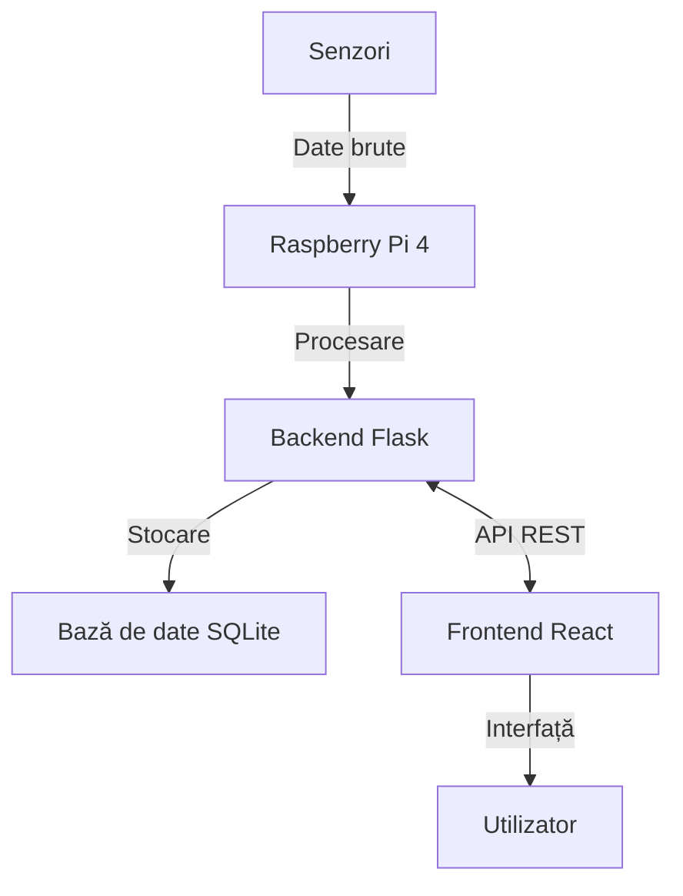
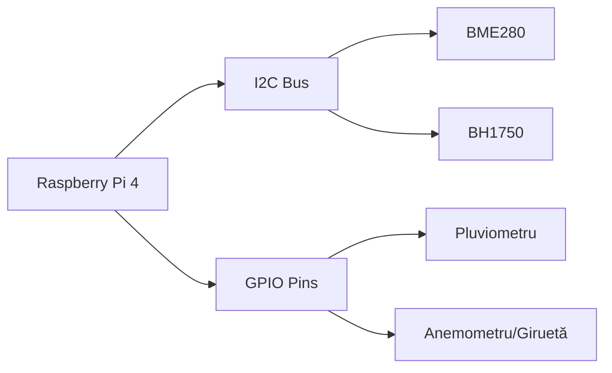
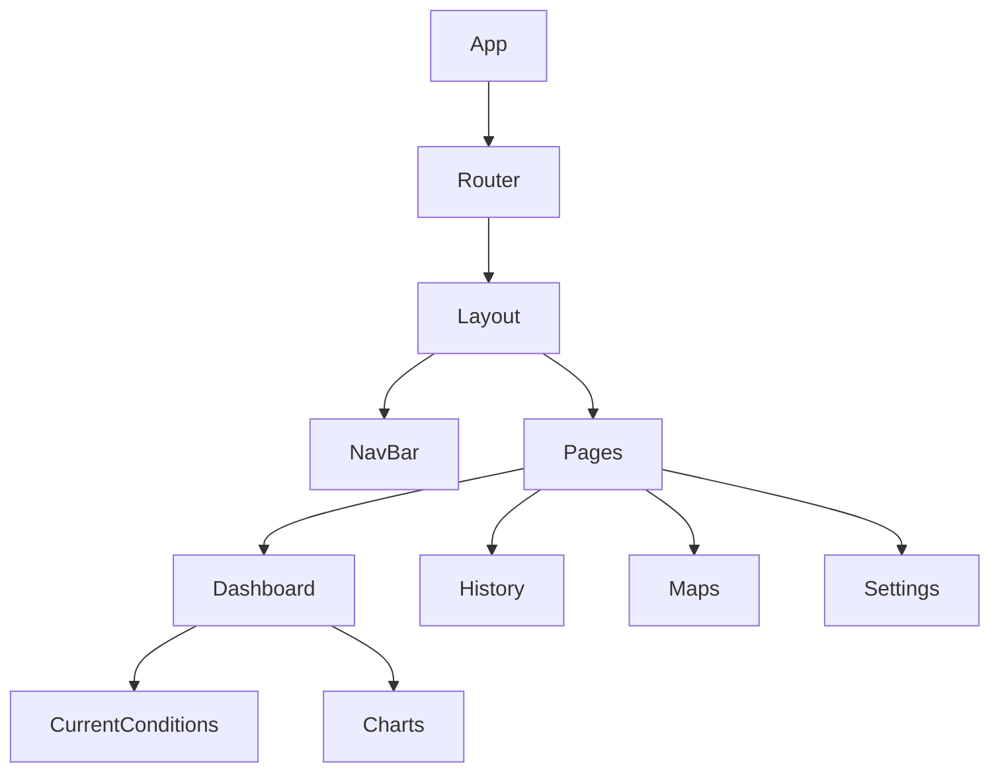
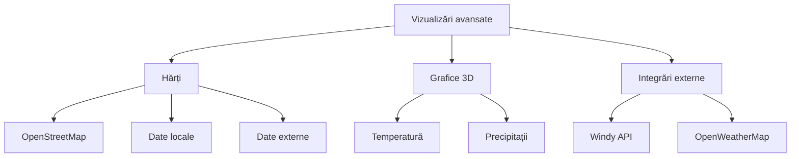
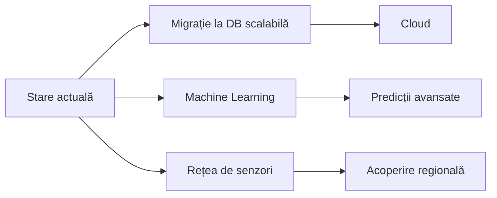

# Documentație Stație Meteo

## 1. Introducere

### 1.1 Scopul proiectului

Proiectul Stație Meteo are ca scop dezvoltarea unei aplicații complete pentru monitorizarea, înregistrarea și vizualizarea parametrilor meteorologici. Sistemul colectează date de la senzori conectați la un Raspberry Pi și le prezintă utilizatorilor printr-o interfață web interactivă și intuitivă.

### 1.2 Arhitectura generală

Proiectul implementează o arhitectură client-server:
- **Backend**: API RESTful dezvoltat cu Flask (Python)
- **Frontend**: Aplicație single-page dezvoltată cu React
- **Bază de date**: SQLite pentru stocarea datelor
- **Hardware**: Raspberry Pi 4 conectat la diverși senzori meteorologici



## 2. Arhitectură hardware

### 2.1 Componente principale

- **Microcontroller**: Raspberry Pi 4 Model B (4GB RAM)
- **Senzori**:
  - BME280: temperatură, umiditate, presiune atmosferică
  - Anemometru și giruetă pentru vânt
  - Senzor UV
  - Senzor de lumină BH1750
  - Pluviometru pentru măsurarea precipitațiilor

### 2.2 Schema de conectare

Senzorii sunt conectați la Raspberry Pi prin diferite interfețe:
- Senzori I2C: BME280, BH1750
- Senzori analogici: convertorul analog-digital ADS1115
- Senzori digitali: conectare directă la pinii GPIO



## 3. Arhitectură software

### 3.1 Structura backend

Backend-ul este implementat folosind Flask și organizat modular:

- **Endpoint-uri API RESTful** pentru:
  - Primirea datelor de la senzori
  - Servirea datelor curente și istorice
  - Autentificarea utilizatorilor
  - Generarea de rapoarte și statistici

- **Procesarea datelor**:
  - Validarea și filtrarea datelor primite de la senzori
  - Agregarea datelor pentru statistici
  - Detecția anomaliilor

Modelele de date principale:

```python
class WeatherData(Base):
    __tablename__ = 'weather_data'
    
    id = Column(Integer, primary_key=True)
    timestamp = Column(DateTime, default=datetime.utcnow, index=True)
    temperature = Column(Float)
    humidity = Column(Float)
    pressure = Column(Float)
    wind_speed = Column(Float)
    wind_direction = Column(String(3))
    light_level = Column(Float)
    uv_index = Column(Float)
    rainfall = Column(Float)
```

### 3.2 Structura frontend

Frontend-ul este implementat cu React și organizat după principiul componentelor:

- **Componente principale**:
  - Dashboard pentru afișarea datelor în timp real
  - Grafice interactive pentru evoluția parametrilor
  - Hărți meteorologice cu suprapuneri de date
  - Vizualizări 3D pentru reprezentări avansate
  - Interfață de istoric și statistici



### 3.3 Fluxul de date

Fluxul de date în aplicație urmează un model unidirecțional:

1. Senzorii colectează date meteorologice
2. Datele sunt validate și procesate de backend
3. Datele sunt stocate în baza de date
4. Frontend-ul solicită date prin API
5. Datele sunt prezentate utilizatorului prin interfața web

### 3.4 Securitate

Aplicația implementează următoarele măsuri de securitate:

- **Autentificare**: Token-based cu JWT
- **Autorizare**: Roluri diferențiate (admin, utilizator, vizitator)
- **Protecția datelor**: Validarea input-urilor, sanitizare
- **Rate limiting**: Limitarea numărului de cereri pentru prevenirea atacurilor

## 4. Funcționalitățile sistemului

### 4.1 Colectare date

- **Parametri monitorizați**: temperatură, umiditate, presiune, vânt, radiație UV, precipitații
- **Frecvența de eșantionare**: optimizată pentru fiecare parametru (60s - 5min)
- **Validare și calibrare**: eliminarea outlierilor, aplicarea factorilor de corecție

### 4.2 Dashboard

Dashboard-ul oferă o prezentare centralizată a datelor meteorologice:

- Vizualizare în timp real a parametrilor curenți
- Grafice interactive pentru ultimele 24 de ore
- Alerte pentru condiții extreme
- Statistici rapide (min/max/medie)

Implementarea actualizărilor în timp real folosește React Query:

```jsx
function useLiveWeatherData() {
  return useQuery('currentWeather', fetchWeatherData, {
    refetchInterval: 5000,  // Polling la 5 secunde
    staleTime: 2000
  });
}
```

### 4.3 Vizualizări avansate

Aplicația oferă vizualizări avansate pentru o mai bună înțelegere a datelor:

- **Hărți interactive** cu suprapuneri de date meteorologice
- **Vizualizări 3D** pentru identificarea tiparelor și corelațiilor
- **Integrare cu servicii externe** (Windy.com, OpenWeatherMap)



### 4.4 Istoric și statistici

Secțiunea de istoric permite:

- Filtrarea datelor pe intervale de timp și parametri
- Generarea de rapoarte statistice (min, max, medie, deviații)
- Exportul datelor în formate diverse (CSV, JSON, PDF)

### 4.5 Sistem de autentificare

Aplicația implementează trei nivele de acces:

- **Anonim**: Acces limitat la date de bază
- **Utilizator standard**: Acces la vizualizări, istoric și export date
- **Administrator**: Acces complet, inclusiv calibrare și configurare sistem

### 4.6 Asistent meteo

Asistentul meteo oferă o interfață conversațională pentru interogarea datelor:

- Interacțiune în limbaj natural
- Răspunsuri pentru întrebări despre condițiile curente, istorice și tendințe
- Suport pentru vizualizări contextuale

## 5. Implementare și detalii tehnice

### 5.1 Configurația hardware și software

Configurația Raspberry Pi:
- Raspberry Pi 4 Model B, 4GB RAM
- Raspberry Pi OS (64-bit)
- Interfețe active: I2C, SPI, GPIO pentru senzori

### 5.2 Structura de fișiere

Backend:
```
backend/
├── app.py                  # Punct de intrare
├── config.py               # Configurații
├── database/               # Modele și gestiune BD
├── api/                    # Endpoint-uri API
├── utils/                  # Utilități
└── scripts/                # Scripturi auxiliare
```

Frontend:
```
frontend/
├── public/                 # Fișiere statice
├── src/                    # Cod sursă React
│   ├── components/         # Componente reutilizabile
│   ├── pages/              # Pagini principale
│   ├── api/                # Servicii pentru API
│   ├── hooks/              # Hooks personalizate
│   └── context/            # Gestionare stare globală
└── package.json            # Dependențe npm
```

### 5.3 API endpoints

Principalele endpoint-uri API:

- `GET /api/weather/current` - Date meteorologice curente
- `GET /api/weather/history` - Istoric cu filtrare
- `POST /api/weather/data` - Adaugă date noi de la senzori
- `GET /api/weather/statistics` - Generează statistici

### 5.4 Managementul stării în frontend

Frontend-ul utilizează o combinație de:

- **React Context** pentru stare globală (temă, autentificare)
- **React Query** pentru date de la server, cu caching
- **React Hooks** pentru stare locală în componente

### 5.5 Securitate și performanță

Măsuri de securitate implementate:
- Autentificare cu JWT și bcrypt pentru hash-uri
- Validarea strictă a input-urilor
- Rate limiting pentru prevenirea atacurilor

Optimizări de performanță:
- Lazy loading pentru componente React
- Paginare pentru seturi mari de date
- Caching pentru reducerea cerilor API
- Compression pentru reducerea traficului

## 6. Concluzii și perspective

### 6.1 Rezumatul proiectului

Stația Meteo este o soluție completă care integrează hardware (Raspberry Pi + senzori) cu software modern (Flask + React) pentru a crea un sistem accesibil de monitorizare meteorologică.

### 6.2 Limitări actuale

- Scalabilitate limitată a bazei de date SQLite
- Capacități de predicție bazate pe modele simple
- Dependența de calitatea senzorilor pentru acuratețea datelor

### 6.3 Dezvoltări viitoare

Potențiale îmbunătățiri viitoare:



- Migrarea la o bază de date scalabilă (PostgreSQL/MongoDB)
- Implementarea de algoritmi ML pentru predicții avansate
- Extinderea rețelei de senzori pentru acoperire geografică mai largă
- Dezvoltarea de aplicații mobile native
- Integrarea cu platforme smart home

### 6.4 Impactul proiectului

Proiectul are potențialul de a contribui în domenii precum:
- Educație meteorologică
- Agricultură (monitorizare microclimă)
- Cercetare climatică amatoră
- Integrare în ecosisteme smart home

## 7. Referințe bibliografice

### 7.1 Resurse tehnice
- Flask Documentation: https://flask.palletsprojects.com/
- React Documentation: https://reactjs.org/docs/
- Raspberry Pi Documentation: https://www.raspberrypi.org/documentation/

### 7.2 Resurse meteo și IoT
- OpenWeatherMap API: https://openweathermap.org/api
- Windy API: https://api.windy.com/
- BME280 Datasheet: https://www.bosch-sensortec.com/products/environmental-sensors/humidity-sensors-bme280/
