# Documentație Aplicație Stație Meteo

## 1. Introducere și prezentare generală

### 1.1 Context și motivație

#### Prezentarea problemei pe care o rezolvă aplicația

Monitorizarea condițiilor meteorologice este esențială pentru multe domenii și activități: agricultură, construcții, planificarea activităților în aer liber sau chiar pentru uz personal. Stațiile meteo comerciale sunt adesea costisitoare, au funcționalități limitate și sunt dificil de integrat cu alte sisteme. Această aplicație oferă o soluție accesibilă, personalizabilă și ușor de extins pentru monitorizarea datelor meteo.

#### Importanța monitorizării datelor meteorologice

Datele meteorologice precise permit:
- Planificarea eficientă a activităților agricole
- Prevenirea situațiilor periculoase cauzate de condiții meteo extreme
- Studierea microclimatului specific unei zone
- Contribuția la proiecte științifice legate de schimbările climatice
- Optimizarea consumului de energie în clădiri

#### Beneficiile unei stații meteo conectate

- Acces la date în timp real de pe orice dispozitiv conectat la internet
- Integrare cu sisteme smart home și alte aplicații
- Stocarea istoricului pentru analize pe termen lung
- Personalizare completă în funcție de nevoile utilizatorului
- Posibilitatea de extindere cu noi senzori sau funcționalități
- Cost mult mai redus față de soluțiile comerciale

### 1.2 Obiective și scopul proiectului

#### Colectarea și vizualizarea datelor meteorologice în timp real

Aplicația colectează continuu date de la diferite tipuri de senzori conectați la Raspberry Pi și le prezintă într-un dashboard interactiv. Utilizatorii pot vedea condițiile meteorologice curente, actualizate în timp real, cu vizualizări intuitive și relevante.

#### Analiza și vizualizarea avansată a datelor istorice

Sistemul stochează toate datele colectate și oferă instrumente avansate pentru analiza acestora:
- Grafice interactive pentru urmărirea tendințelor
- Filtre pentru selecția perioadelor de interes
- Statistici automate (valori medii, minime, maxime)
- Export de date în formate standard (CSV, JSON)

#### Oferirea de interfețe intuitive pentru monitorizare

Interfața utilizator a fost proiectată să fie accesibilă și ușor de folosit pentru oricine:
- Dashboard principal cu indicatori vizuali clari
- Sistem de navigare simplu și logic
- Design responsive pentru acces de pe orice dispozitiv
- Asistent virtual pentru interacțiune conversațională cu datele

### 1.3 Arhitectura generală

#### Arhitectura client-server

Aplicația folosește o arhitectură client-server care separă interfața utilizator (frontend) de procesarea și stocarea datelor (backend). Această abordare permite dezvoltarea independentă a componentelor și asigură o mai bună scalabilitate a sistemului.

#### Componentele principale ale sistemului

- **Hardware**: Raspberry Pi 4 conectat la diverși senzori meteorologici
- **Backend**: Aplicație Flask (Python) pentru procesarea și stocarea datelor
- **Frontend**: Interfață web React pentru interacțiunea cu utilizatorul
- **Baza de date**: SQLite pentru stocarea persistentă a datelor
- **Modul de achiziție**: Script Python pentru comunicarea cu senzorii

#### Diagrama de ansamblu a sistemului

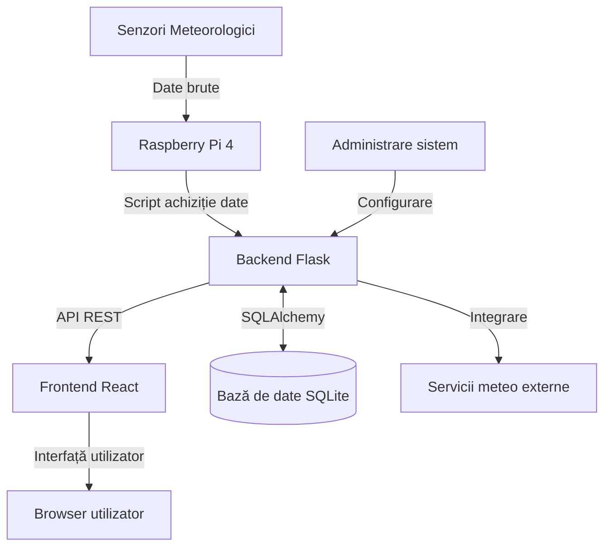

## 2. Arhitectura hardware

### 2.1 Platformă și specificații

#### Raspberry Pi 4 ca unitate centrală de procesare

Am ales Raspberry Pi 4 ca platformă centrală pentru stația meteo datorită combinației excelente între puterea de procesare, conectivitatea, prețul accesibil și comunitatea mare de suport. Această platformă oferă toate resursele necesare pentru colectarea, procesarea și transmiterea datelor meteorologice.

#### Specificații tehnice (procesor, memorie, conectivitate)

- **Procesor**: Broadcom BCM2711, Quad-core Cortex-A72 (ARM v8) 64-bit @ 1.5GHz
- **Memorie**: 2GB LPDDR4-3200 SDRAM
- **Conectivitate**:
  - Wi-Fi 2.4 GHz și 5.0 GHz IEEE 802.11ac
  - Bluetooth 5.0, BLE
  - Gigabit Ethernet
  - 2 × USB 3.0, 2 × USB 2.0
- **GPIO**: 40 pini pentru conectarea senzorilor
- **Stocare**: Card microSD 32GB (minim recomandat)

#### Avantajele utilizării Raspberry Pi în acest context

- Cost accesibil comparativ cu soluțiile industriale
- Flexibilitate mare în conectarea senzorilor prin diverse interfețe (GPIO, I2C, SPI)
- Comunitate activă și resurse abundente de documentație
- Sistem de operare complet (Linux) cu suport pentru multe limbaje și biblioteci
- Consum energetic redus, ideal pentru funcționare continuă
- Dimensiuni compacte, ușor de integrat în soluții existente

### 2.2 Senzori și echipamente

#### Lista completă a senzorilor utilizați

Stația meteo utilizează următorii senzori pentru măsurarea parametrilor meteorologici:

- **BME280**: Senzor de temperatură, umiditate și presiune atmosferică
- **DHT22**: Senzor secundar pentru temperatură și umiditate (redundanță)
- **BH1750**: Senzor pentru intensitatea luminii
- **ML8511**: Senzor pentru radiația UV
- **Anemometru cu cupe**: Pentru măsurarea vitezei vântului
- **Giruetă**: Pentru determinarea direcției vântului
- **Pluviometru basculant**: Pentru măsurarea cantității de precipitații

#### Specificații tehnice pentru fiecare senzor

| Senzor | Parametri măsurați | Interval de măsurare | Precizie | Interfață |
|--------|-------------------|---------------------|----------|-----------|
| BME280 | Temperatură, umiditate, presiune | -40 la 85°C, 0-100% RH, 300-1100 hPa | ±0.5°C, ±3% RH, ±1 hPa | I2C/SPI |
| DHT22 | Temperatură, umiditate | -40 la 80°C, 0-100% RH | ±0.5°C, ±2% RH | Digital (one-wire) |
| BH1750 | Intensitatea luminii | 1-65535 lux | ±20% | I2C |
| ML8511 | Radiație UV | 0-15 UV Index | ±1 UV Index | Analog |
| Anemometru | Viteza vântului | 0-160 km/h | ±5% | Digital (impulsuri) |
| Giruetă | Direcția vântului | 8-16 direcții | ±22.5° | Rezistivă (analog) |
| Pluviometru | Cantitate precipitații | 0.2mm/basculare | ±4% | Digital (impulsuri) |

#### Diagrama de conectare a senzorilor la Raspberry Pi

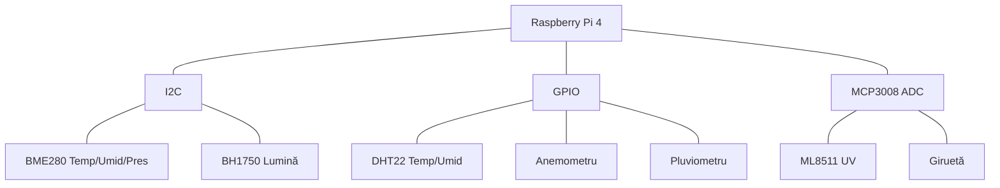

### 2.3 Alimentare și autonomie

#### Sistem de alimentare (surse, baterii)

Stația meteo poate fi alimentată prin:
- **Alimentare principală**: Adaptor de 5V/3A conectat la rețeaua electrică
- **Alimentare de rezervă**: Baterie LiPo de 10000mAh cu circuit de încărcare
- **Alimentare autonomă** (opțional): Panou solar de 10W cu controler de încărcare

#### Consum energetic

Consumul energetic al sistemului în configurația standard este:
- Raspberry Pi 4: ~2.5-3W în regim normal
- Senzori: ~0.2-0.5W în total
- Consum total: ~3-4W

#### Strategii pentru autonomie extinsă

Pentru a maximiza autonomia sistemului, am implementat:
- Mod de funcționare economică cu reducerea frecvenței procesorului
- Ajustarea frecvenței de colectare a datelor în funcție de necesități
- Oprirea temporară a componentelor neesențiale în perioade de inactivitate
- Algoritmul "sleep/wake" pentru economisirea energiei
- Dimensionarea corectă a panoului solar și a bateriei în funcție de locație

## 3. Arhitectura software

### 3.1 Prezentare generală

#### Structura arhitecturală (backend, frontend, baza de date)

Aplicația Stației Meteo implementează o arhitectură modernă client-server, bazată pe principiile separării responsabilităților și pe o abordare orientată către servicii. Această arhitectură permite dezvoltarea independentă a componentelor, facilitând scalabilitatea, mentenabilitatea și testabilitatea întregului sistem.

Componentele principale ale arhitecturii sunt:

- **Frontend (Client)**: Aplicație web dezvoltată în React, responsabilă cu interacțiunea cu utilizatorul și prezentarea datelor într-un mod intuitiv și atractiv.
- **Backend (Server)**: API RESTful dezvoltat în Flask (Python), care gestionează logica de business, procesarea datelor și comunicarea cu baza de date.
- **Baza de date**: SQLite pentru stocarea persistentă a datelor meteorologice și a informațiilor utilizatorilor.
- **Modul de achiziție date**: Script Python care rulează pe Raspberry Pi 4 pentru colectarea datelor de la senzori și transmiterea acestora către backend.

#### Tipul arhitecturii (RESTful)

Aplicația urmează principiile unei arhitecturi RESTful, cu separarea clară între frontend și backend. Această abordare oferă următoarele avantaje:

- Dezvoltarea independentă a componentelor
- Scalarea separată a fiecărei componente
- Integrarea facilă cu alte sisteme
- Testarea independentă a fiecărui nivel

#### Diagrama componentelor software

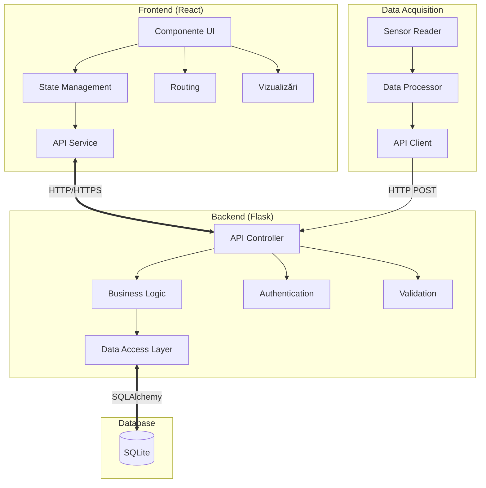

#### Fluxul general al datelor

1. Senzorii colectează date meteorologice
2. Modulul de achiziție date le trimite către backend prin API-ul REST
3. Backend-ul validează, procesează și stochează datele în baza de date
4. Frontend-ul solicită date de la backend prin API
5. Utilizatorul interacționează cu frontend-ul pentru a vizualiza și analiza datele

### 3.2 Backend (Python/Flask)

#### Structura aplicației Flask

Backend-ul aplicației este dezvoltat utilizând Flask, un framework web lightweight și flexibil pentru Python, care facilitează crearea de API-uri RESTful și servirea conținutului static.

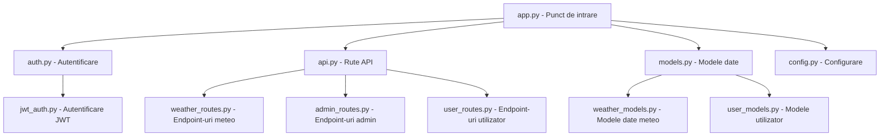

Organizarea codului pe directoare este următoarea:

```
/backend
├── app.py                # Punctul de intrare al aplicației
├── auth.py               # Gestionarea autentificării
├── database.py           # Configurare și modele baza de date
├── config.py             # Configurări pentru medii diferite
├── routes/               # Blueprint-uri pentru rutele API
│   ├── weather_data.py   # Endpoint-uri pentru date meteo
│   ├── admin.py          # Endpoint-uri administrative
│   └── user.py           # Endpoint-uri pentru utilizatori
├── services/             # Logica de business
│   ├── data_processor.py # Procesare și analiză date
│   ├── sensor_service.py # Comunicare cu senzori
│   └── stats_service.py  # Calcul statistici
└── utils/                # Funcții utilitare
    ├── validators.py     # Validatori date
    └── helpers.py        # Funcții ajutătoare
```

#### API-uri și endpoint-uri

Backend-ul expune un set complet de API-uri RESTful pentru interacțiunea cu clientul:

**Autentificare și Utilizatori**:
- `POST /auth/login`: Autentificare utilizator
- `POST /auth/register`: Înregistrare utilizator nou
- `POST /auth/refresh`: Reîmprospătare token JWT
- `POST /auth/logout`: Delogare utilizator
- `GET /auth/user`: Obținere informații utilizator curent

**Date Meteorologice**:
- `GET /api/weather/current`: Obținere date curente
- `GET /api/weather/history`: Obținere date istorice cu filtrare
- `POST /api/weather/data`: Trimitere date noi (protejat)
- `GET /api/weather/stats`: Obținere statistici (min, max, medii)
- `GET /api/weather/export/{format}`: Export date în format specificat

**Administrare**:
- `GET /api/admin/users`: Listare utilizatori (doar admin)
- `POST /api/admin/users`: Creare utilizator (doar admin)
- `PUT /api/admin/users/{id}`: Modificare utilizator (doar admin)
- `DELETE /api/admin/users/{id}`: Ștergere utilizator (doar admin)
- `PUT /api/admin/calibration`: Actualizare calibrare senzori

#### Procesarea și stocarea datelor

Backend-ul implementează un model sofisticat de procesare a datelor:

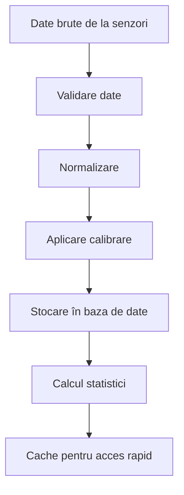

Etapele principale în procesarea datelor:

1. **Validare**: Verificarea integrității și validității datelor primite de la senzori
   - Verificarea formatului și tipurilor de date
   - Confirmarea că valorile sunt în intervalele fizic posibile
   - Detectarea și marcarea outlier-ilor

2. **Normalizare**: Standardizarea unităților de măsură și formatelor
   - Conversie la unități standard (°C, hPa, mm, etc.)
   - Aplicarea factorilor de calibrare pentru compensarea erorilor senzorilor
   - Uniformizarea timestamp-urilor

3. **Agregare**: Calculul valorilor medii, minime și maxime pentru diferite intervale de timp
   - Agregare orară
   - Agregare zilnică
   - Agregare lunară

4. **Persistență**: Stocarea datelor în baza de date SQLite
   - Stocarea datelor brute pentru păstrarea integrității
   - Stocarea agregărilor pentru acces rapid
   - Indexarea pentru optimizarea performanței interogărilor

5. **Caching**: Implementarea unui mecanism de cache pentru optimizarea performanței
   - Cache pentru date curente
   - Cache pentru statistici calculate frecvent
   - Invalidare automată la primirea de date noi

Exemplu de cod pentru validarea datelor:

```python
def validate_weather_data(data):
    """Validează datele primite de la senzori."""
    errors = []
    
    # Verifică prezența câmpurilor obligatorii
    required_fields = ['timestamp', 'temperature', 'humidity', 'pressure']
    for field in required_fields:
        if field not in data:
            errors.append(f'Câmpul {field} lipsește')
    
    # Validare timestamp
    if 'timestamp' in data:
        try:
            timestamp = datetime.fromtimestamp(data['timestamp'])
            if timestamp > datetime.now() + timedelta(minutes=5):
                errors.append('Timestamp din viitor')
        except:
            errors.append('Format timestamp invalid')
    
    # Validare temperatură
    if 'temperature' in data:
        temp = data['temperature']
        if not isinstance(temp, (int, float)) or temp < -40 or temp > 60:
            errors.append('Valoare temperatură în afara intervalului valid (-40 la 60°C)')
    
    # Validare umiditate
    if 'humidity' in data:
        humidity = data['humidity']
        if not isinstance(humidity, (int, float)) or humidity < 0 or humidity > 100:
            errors.append('Valoare umiditate în afara intervalului valid (0-100%)')
    
    # Validare presiune
    if 'pressure' in data:
        pressure = data['pressure']
        if not isinstance(pressure, (int, float)) or pressure < 300 or pressure > 1100:
            errors.append('Valoare presiune în afara intervalului valid (300-1100 hPa)')
    
    return len(errors) == 0, errors
```

#### Managementul autentificării și autorizării

Sistemul de autentificare utilizează o combinație de JWT (JSON Web Tokens) și Flask-Login pentru a asigura securitatea și flexibilitatea:

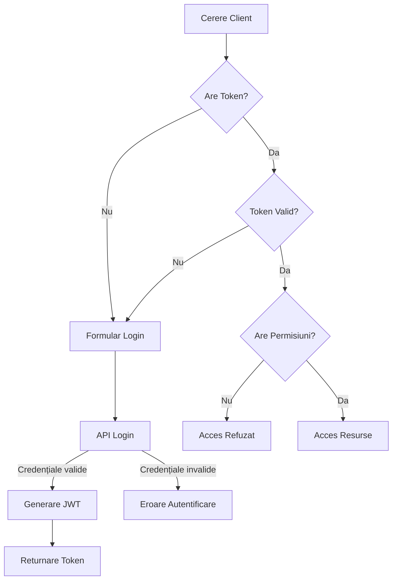

Componentele principale ale sistemului de autentificare:

1. **JSON Web Tokens (JWT)**:
   - Utilizate pentru autentificarea API-urilor
   - Token-uri de acces (short-lived, 1 oră)
   - Token-uri de reîmprospătare (long-lived, 7 zile)
   - Semnare cu algoritm HS256 și cheie secretă configurabilă

2. **Hash-uri de parole**:
   - Parolele sunt stocate folosind algoritmi de hashing securizați (Werkzeug)
   - Salt unic pentru fiecare utilizator
   - Funcții pentru verificarea parolelor fără a le decripta

3. **Control de acces bazat pe roluri**:
   - Implementare a două roluri principale: utilizator standard și administrator
   - Metadate pentru roluri stocate în token-urile JWT
   - Verificarea rolurilor pentru rutele protejate

4. **Middleware de autorizare**:
   - Decoratori Flask pentru protejarea rutelor
   - Verificarea prezenței și validității token-urilor
   - Verificarea permisiunilor bazate pe rol

Exemplu de implementare a autentificării cu JWT:

```python
from flask import Flask, request, jsonify
from flask_jwt_extended import JWTManager, create_access_token, jwt_required, get_jwt_identity
from werkzeug.security import generate_password_hash, check_password_hash
from database import db, User

app = Flask(__name__)
app.config['JWT_SECRET_KEY'] = os.environ.get('JWT_SECRET_KEY', 'secret-key-de-test')
app.config['JWT_ACCESS_TOKEN_EXPIRES'] = timedelta(hours=1)
jwt = JWTManager(app)

@app.route('/auth/login', methods=['POST'])
def login():
    data = request.get_json()
    user = User.query.filter_by(username=data['username']).first()
    if user and user.check_password(data['password']):
        access_token = create_access_token(identity=user.id)
        return jsonify(access_token=access_token)
    return jsonify({'msg': 'Credențiale invalide'}), 401

@app.route('/api/protected', methods=['GET'])
@jwt_required()
def protected():
    current_user_id = get_jwt_identity()
    user = User.query.get(current_user_id)
    return jsonify(logged_in_as=user.username), 200
```

### 3.3 Frontend (React)

#### Arhitectura aplicației React

Frontend-ul este dezvoltat utilizând React, o bibliotecă JavaScript pentru construirea interfețelor utilizator interactive, cu o arhitectură modulară și componentizată, care facilitează dezvoltarea și mentenabilitatea.

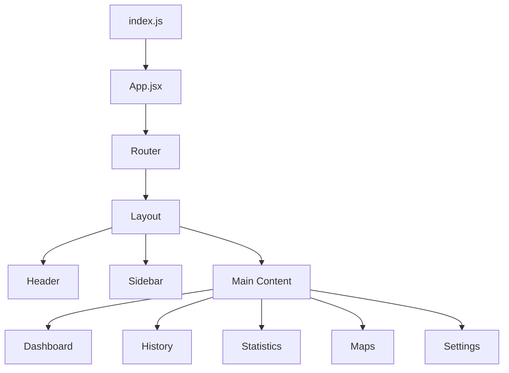

Structura organizatorică a codului:

```
/client
├── public/              # Fișiere publice (index.html, favicon)
├── src/                 # Codul sursă
│   ├── App.jsx          # Componenta principală, definește rutele
│   ├── index.jsx        # Punct de intrare al aplicației
│   ├── api/             # Servicii pentru comunicarea cu API-ul
│   ├── components/      # Componente reutilizabile
│   │   ├── ui/          # Componente UI de bază
│   │   ├── charts/      # Componente pentru grafice
│   │   ├── maps/        # Componente pentru hărți
│   │   └── layout/      # Componente pentru layout
│   ├── context/         # Contexte React
│   ├── hooks/           # Hooks personalizate
│   ├── pages/           # Pagini ale aplicației
│   └── utils/           # Utilități și helperi
└── package.json         # Dependențe și scripturi
```

#### Componentele principale

Frontend-ul este structurat în jurul unor componente reutilizabile, organizate pe mai multe niveluri:

1. **Componente de bază**:
   - Butoane, input-uri, carduri personalizate
   - Componente care încapsulează elemente UI comune
   - Implementate folosind Chakra UI pentru consistență

2. **Componente compuse**:
   - Grafice: Wrapper-e peste react-chartjs-2 pentru date meteo
   - Formulare: Componente pentru introducerea și validarea datelor
   - Tabele: Afișarea datelor tabulare cu sortare și filtrare
   - Panouri de control: Grupare de controale pentru funcționalități specifice

3. **Pagini**:
   - Dashboard: Afișează datele curente și grafice pentru parametrii principali
   - Istoric: Permite vizualizarea și filtrarea datelor istorice
   - Statistici: Prezintă analize și statistici derivate din date
   - Hărți: Oferă vizualizări geografice ale datelor
   - Setări: Configurarea stației meteo și a preferințelor utilizatorului

4. **Layout**:
   - Structura de bază a aplicației
   - Bara laterală pentru navigare (desktop)
   - Bara de navigare mobilă
   - Container principal pentru conținut

Exemplu de componentă React pentru afișarea temperaturii:

```jsx
import React from 'react';
import { Box, Text, Flex, Stat, StatLabel, StatNumber, StatHelpText } from '@chakra-ui/react';
import { FaTemperatureHigh } from 'react-icons/fa';
import { LineChart } from '../charts/LineChart';
import { useWeatherData } from '../../hooks/useWeatherData';

const TemperatureCard = ({ currentOnly = false }) => {
  const { current, history } = useWeatherData('temperature');
  
  return (
    <Box borderWidth="1px" borderRadius="lg" p={4} shadow="sm">
      <Flex alignItems="center" mb={2}>
        <FaTemperatureHigh size="1.5em" />
        <Text ml={2} fontSize="lg" fontWeight="bold">Temperatură</Text>
      </Flex>
      
      <Stat mt={2}>
        <StatLabel>Valoare curentă</StatLabel>
        <StatNumber>{current?.value ? `${current.value.toFixed(1)}°C` : 'N/A'}</StatNumber>
        <StatHelpText>
          Actualizat la: {current?.timestamp ? new Date(current.timestamp).toLocaleTimeString() : 'N/A'}
        </StatHelpText>
      </Stat>
      
      {!currentOnly && history?.length > 0 && (
        <Box mt={4} h="200px">
          <LineChart 
            data={history.map(item => ({ x: new Date(item.timestamp), y: item.value }))}
            color="#E53E3E"
            label="Temperatură (°C)"
          />
        </Box>
      )}
    </Box>
  );
};

export default TemperatureCard;
```

#### State management

Aplicația utilizează o combinație de tehnici moderne pentru gestionarea stării:

1. **React Query**:
   - Pentru gestionarea stării server-side (date de la API)
   - Caching și invalidare automată
   - Polling pentru date actualizate în timp real
   - Gestionarea stărilor de loading și error

2. **Context API**:
   - Pentru starea globală a aplicației
   - AuthContext: Starea de autentificare și informații utilizator
   - ThemeContext: Preferințe pentru tema aplicației (light/dark)
   - SettingsContext: Preferințe utilizator și configurări

3. **Hooks personalizate**:
   - Pentru logica reutilizabilă și encapsularea funcționalităților complexe
   - useWeatherData: Obținerea și filtrarea datelor meteo
   - useStats: Calcule statistice pe date
   - useChartConfig: Configurații pentru diferite tipuri de grafice

Exemplu de utilizare React Query pentru obținerea datelor meteo:

```jsx
import { useQuery } from 'react-query';
import { fetchCurrentWeatherData } from '../api/weatherApi';

export function useCurrentWeather() {
  return useQuery(
    'currentWeather', 
    fetchCurrentWeatherData, 
    {
      refetchInterval: 5000, // Polling la fiecare 5 secunde
      staleTime: 2000,      // Consideră datele valide pentru 2 secunde
    }
  );
}
```

#### Routing și navigare

Navigarea în aplicație este gestionată prin React Router, care asigură:

1. **Rutare pentru diferitele pagini ale aplicației**:
   - Definirea rutelor principale și secundare
   - Navigare programatică
   - Gestionarea parametrilor de rută pentru filtrare

2. **Protejarea rutelor care necesită autentificare**:
   - Componente wrapper pentru verificarea autentificării
   - Redirecționare către pagina de login pentru utilizatorii neautentificați
   - Păstrarea URL-ului dorit pentru revenire după autentificare

3. **Restricționarea accesului la rutele administrative**:
   - Verificarea rolului utilizatorului
   - Blocarea accesului pentru utilizatorii fără permisiuni adecvate

Exemplu de configurare a rutelor:

```jsx
import { BrowserRouter as Router, Routes, Route, Navigate } from 'react-router-dom';
import { useAuth } from './hooks/useAuth';
import Layout from './components/layout/Layout';
import Dashboard from './pages/Dashboard';
import History from './pages/History';
import Login from './pages/auth/Login';
import Register from './pages/auth/Register';
import AdminDashboard from './pages/admin/AdminDashboard';

function ProtectedRoute({ children, requireAdmin = false }) {
  const { isAuthenticated, user } = useAuth();
  
  if (!isAuthenticated) {
    return <Navigate to="/login" />;
  }
  
  if (requireAdmin && user.role !== 'admin') {
    return <Navigate to="/dashboard" />;
  }
  
  return children;
}

function App() {
  return (
    <Router>
      <Routes>
        <Route path="/login" element={<Login />} />
        <Route path="/register" element={<Register />} />
        <Route 
          path="/" 
          element={
            <ProtectedRoute>
              <Layout />
            </ProtectedRoute>
          }
        >
          <Route index element={<Navigate to="/dashboard" />} />
          <Route path="dashboard" element={<Dashboard />} />
          <Route path="history" element={<History />} />
          <Route 
            path="admin/*" 
            element={
              <ProtectedRoute requireAdmin={true}>
                <AdminDashboard />
              </ProtectedRoute>
            } 
          />
        </Route>
      </Routes>
    </Router>
  );
}
```

#### Responsive design

Aplicația implementează un design responsive care se adaptează la diferite dimensiuni de ecran:

1. **Utilizarea sistemului de grid și breakpoint-uri din Chakra UI**:
   - Layout fluid care se adaptează la dimensiunea ecranului
   - Componente responsive cu dimensiuni adaptabile
   - Utilizarea flexbox și grid pentru aranjamente complexe

2. **Navigare diferită pentru dispozitive mobile vs. desktop**:
   - Sidebar pe desktop
   - Meniu hamburger pe mobile
   - Reorganizarea componentelor pentru spațiu limitat

3. **Reorganizarea componentelor în funcție de dimensiunea ecranului**:
   - Layout pe coloane multiple pe desktop
   - Layout pe o singură coloană pe mobile
   - Grafice și vizualizări redimensionate automat

### 3.4 Baza de date

#### Structura bazei de date SQLite

Aplicația utilizează SQLite ca sistem de management al bazei de date, oferind un echilibru excelent între simplitate, performanță și portabilitate.

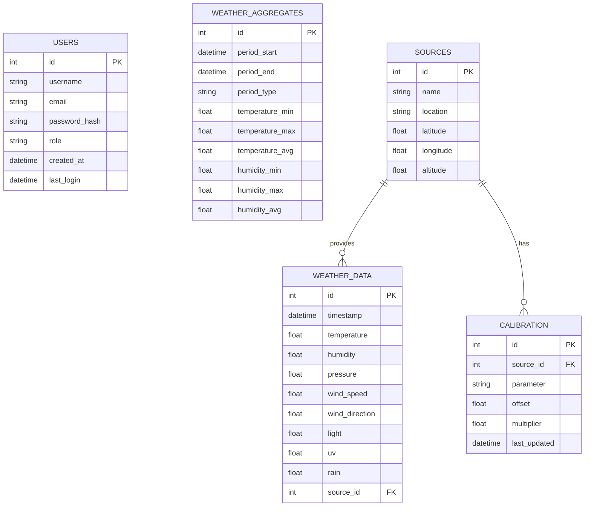

#### Schema bazei de date (tabele, relații)

Principalele tabele din baza de date:

1. **users**: Stochează informații despre utilizatori
   - id (PK): Identificator unic
   - username: Nume de utilizator (unic)
   - email: Adresa de email (unică)
   - password_hash: Hash-ul parolei
   - role: Rolul utilizatorului (user/admin)
   - created_at: Data creării contului
   - last_login: Data ultimei autentificări

2. **weather_data**: Stochează datele meteorologice brute
   - id (PK): Identificator unic
   - timestamp: Momentul înregistrării datelor
   - temperature, humidity, pressure, etc.: Valorile parametrilor măsurați
   - source_id (FK): Referire la sursa datelor (senzorul sau stația care a furnizat datele)

3. **weather_aggregates**: Stochează date agregate pentru eficientizarea interogărilor
   - id (PK): Identificator unic
   - period_start, period_end: Perioada pentru care s-a făcut agregarea
   - period_type: Tipul perioadei (orar, zilnic, lunar)
   - Valori agregate (min, max, avg) pentru fiecare parametru meteorologic

4. **sources**: Informații despre sursele de date (senzori, stații)
   - id (PK): Identificator unic
   - name: Numele sursei
   - location: Locația fizică a sursei
   - latitude, longitude, altitude: Coordonatele geografice

5. **calibration**: Setări de calibrare pentru senzori
   - id (PK): Identificator unic
   - source_id (FK): Referire la sursa (senzorul) care necesită calibrare
   - parameter: Parametrul care necesită calibrare (temperatura, umiditate etc.)
   - offset, multiplier: Valori de calibrare

#### Strategie de stocare și arhivare a datelor

Pentru a asigura performanța și a gestiona eficient volumul de date, aplicația implementează:

1. **Indexarea coloanelor frecvent utilizate în căutări**:
   - Indecși pe timestamp pentru căutări rapide pe intervale de timp
   - Indecși pe source_id pentru filtrarea după sursa datelor

2. **Agregarea datelor pentru optimizarea stocării**:
   - Datele brute sunt păstrate la rezoluție maximă pentru perioada recentă (ultimele 30 de zile)
   - Agregare orară pentru datele mai vechi de 30 de zile
   - Agregare zilnică pentru datele mai vechi de 90 de zile
   - Agregare lunară pentru datele mai vechi de un an

3. **Strategii de backup și restaurare**:
   - Backup-uri automate zilnice ale bazei de date
   - Backup-uri incrementale pentru optimizarea spațiului
   - Mecanism de restaurare în caz de corupere a datelor

4. **Optimizarea interogărilor**:
   - Utilizarea viziunilor (views) pentru interogări complexe frecvente
   - Caching la nivel de aplicație pentru rezultatele interogărilor comune
   - Limitarea rezultatelor pentru interogări pe intervale mari de timp

### 3.5 Comunicare și protocoale

#### Protocoale de comunicare

Aplicația utilizează următoarele protocoale de comunicare:

1. **HTTP/HTTPS**:
   - Pentru comunicarea dintre frontend și backend
   - Autentificare și autorizare
   - Transfer de date și fișiere statice

2. **WebSockets** (planificat pentru actualizări viitoare):
   - Pentru actualizări în timp real ale dashboard-ului
   - Notificări pentru condiții meteorologice extreme
   - Reducerea latenței în vizualizarea datelor curente

3. **Serial/I2C/SPI**:
   - Pentru comunicarea cu senzorii la nivelul Raspberry Pi
   - Citirea datelor și configurarea parametrilor

#### Format de schimb de date

Aplicația utilizează JSON (JavaScript Object Notation) ca format standard pentru schimbul de date, datorită:
- Simplicității și lizibilității
- Suportului nativ în JavaScript și Python
- Flexibilității în reprezentarea structurilor de date complexe
- Dimensiunii reduse comparativ cu alte formate (ex. XML)

Exemplu de date meteorologice în format JSON:

```json
{
  "timestamp": 1621508400,
  "station_id": "main_station",
  "temperature": 22.5,
  "humidity": 65.3,
  "pressure": 1013.25,
  "wind": {
    "speed": 12.3,
    "direction": 270
  },
  "rain": 0.0,
  "light": 8500,
  "uv": 5.2
}
```

#### Securizarea comunicației

Pentru a asigura securitatea comunicației dintre componentele sistemului, sunt implementate următoarele măsuri:

1. **Autentificare cu JWT**:
   - Toate cererile către API-urile protejate includ un token JWT în header-ul Authorization
   - Verificarea validității și expirării token-urilor pentru fiecare cerere

2. **HTTPS** (pentru mediul de producție):
   - Criptarea comunicației între client și server
   - Certificat SSL/TLS pentru domeniul aplicației
   - Redirecționare automată HTTP → HTTPS

3. **Validare CSRF**:
   - Protecție împotriva atacurilor Cross-Site Request Forgery
   - Token-uri CSRF pentru operațiunile sensibile
   - Verificarea originii cererilor

4. **Rate limiting**:
   - Limitarea numărului de cereri pentru a preveni atacurile de tip brute force și DoS
   - Ferestre de timp adaptive pentru limitare
   - Tratarea diferită a utilizatorilor autentificați față de cei anonimi

## 4. Funcționalitățile sistemului

### 4.1 Colectare date

#### Senzori și parametri monitorizați

Sistemul de colectare a datelor reprezintă fundamentul întregii aplicații, asigurând fluxul continuu de informații meteorologice pentru procesare și vizualizare.

Sistemul utilizează o varietate de senzori conectați la Raspberry Pi 4 pentru a măsura parametrii meteorologici:

- **Temperatură și umiditate**: Senzori de tip DHT22 sau BME280, cu precizie de ±0.5°C pentru temperatură și ±2% pentru umiditate
- **Presiune atmosferică**: Senzori BMP280 sau BME280, cu precizie de ±1 hPa
- **Vânt**: Anemometru pentru viteză și giruetă pentru direcție
- **Lumină**: Fotorezistori sau module specializate BH1750
- **Radiație UV**: Senzori UV pentru monitorizarea radiației solare
- **Precipitații**: Pluviometru basculant pentru măsurarea cantității de precipitații

#### Frecvența de eșantionare

Datele sunt colectate cu frecvențe diferite, optimizate pentru fiecare tip de senzor:

- Parametri cu variație rapidă (temperatură, umiditate, presiune): la fiecare 60 secunde
- Parametri cu variație lentă (radiație, precipitații): la fiecare 5 minute
- Evenimente meteorologice (direcția vântului): la schimbare sau la fiecare 30 secunde

Acest sistem de eșantionare echilibrează nevoia de date actualizate frecvent cu optimizarea resurselor hardware și de stocare.

#### Prelucrarea și validarea datelor primare

Datele colectate trec printr-un proces de validare și prelucrare:

- **Validarea range-ului**: Verificarea dacă valorile se încadrează în intervalele fizic posibile
- **Filtrarea outlierilor**: Eliminarea valorilor aberante prin algoritmi statistici
- **Aplicarea calibrării**: Utilizarea offset-urilor și multiplicatorilor specifici fiecărui senzor
- **Conversia unităților**: Standardizarea unităților de măsură (°C, hPa, mm, etc.)
- **Agregarea temporară**: Calculul valorilor medii pentru intervalul de raportare

Exemplu de cod pentru validarea și calibrarea datelor:

```python
def process_sensor_data(raw_data, sensor_type, calibration_data):
    """Procesarea datelor brute de la senzori."""
    # Valorile sunt valide?
    if sensor_type == 'temperature':
        if raw_data < -40 or raw_data > 85:
            return None  # Valoare invalidă
    elif sensor_type == 'humidity':
        if raw_data < 0 or raw_data > 100:
            return None  # Valoare invalidă
    
    # Aplicare calibrare
    if sensor_type in calibration_data:
        offset = calibration_data[sensor_type]['offset']
        multiplier = calibration_data[sensor_type]['multiplier']
        calibrated_value = (raw_data * multiplier) + offset
    else:
        calibrated_value = raw_data
    
    # Convertire în unități standard dacă e necesar
    # ...
    
    return calibrated_value
```

#### Simularea senzorilor pentru testare

Pentru a facilita dezvoltarea și testarea aplicației fără necesitatea unei instalări hardware complete, am implementat un modul de simulare a senzorilor care:

- Generează date aleatorii în intervale realiste pentru fiecare parametru
- Simulează variații diurne și sezoniere pentru parametri precum temperatura
- Introduce ocazional "anomalii" controlate pentru a testa robustețea sistemului
- Poate fi configurat să simuleze diferite condiții meteorologice (furtună, cer senin, etc.)

Acest simulator rulează ca un script Python separat și transmite datele către backend folosind același API ca și sistemul real.

### 4.2 Dashboard

#### Componente și layout

Dashboard-ul reprezintă interfața principală a aplicației, oferind o prezentare centralizată și intuitivă a tuturor parametrilor meteorologici relevanți.

Dashboard-ul este structurat în zone funcționale distincte:

- **Secțiunea de condiții curente**: Afișează valorile actuale pentru toți parametrii monitorizați, cu indicatori vizuali pentru valorile ieșite din normal
- **Grafice interactive**: Prezintă evoluția parametrilor în ultimele 24 de ore, cu posibilitatea de zoom și pan
- **Alerte și notificări**: Evidențiază condițiile extreme sau schimbările semnificative
- **Prognoză simplă**: Oferă o predicție de bază bazată pe tendințele recente și date istorice

#### Vizualizare în timp real

Dashboard-ul se actualizează automat la fiecare 5 secunde pentru a reflecta cele mai recente date. Implementarea acestei funcționalități folosește React Query pentru polling eficient:

```jsx
import { useQuery } from 'react-query';
import { fetchWeatherData } from '../api/weatherApi';

function useLiveWeatherData() {
  return useQuery('currentWeather', fetchWeatherData, {
    refetchInterval: 5000,  // Polling la 5 secunde
    refetchOnWindowFocus: true,
    staleTime: 2000,
    onError: (error) => console.error('Error fetching weather data:', error)
  });
}
```

#### Reprezentări grafice interactive

Graficele din dashboard utilizează biblioteca Chart.js adaptată pentru React (react-chartjs-2), oferind:

- Vizualizări line, bar și gauge pentru diferite tipuri de date
- Interactivitate: hover pentru detalii, zoom pentru intervale specifice
- Teme adaptate pentru modul întunecat/luminos
- Responsivitate pe diferite dispozitive

#### Statistici rapide și alerte

Dashboard-ul prezintă statistici calculate în timp real:

- Valorile minime și maxime pentru ziua curentă
- Comparații cu valorile medii pentru perioada anului
- Tendințe pentru următoarele ore

Sistemul de alerte evidențiază condițiile care necesită atenție:

- Temperaturi extreme (caniculă sau îngheț)
- Schimbări rapide de presiune (posibil front atmosferic)
- Viteze mari ale vântului
- Precipitații abundente

### 4.3 Vizualizări avansate

#### Hărți interactive cu suprapuneri meteo

Componenta de hărți utilizează biblioteca Leaflet împreună cu diverse plugin-uri pentru a oferi:

- Straturi de bază multiple: OpenStreetMap, imagini satelit, teren
- Suprapuneri meteorologice: Temperatură (heatmap), precipitații, vânt, acoperire cu nori
- Integrare cu servicii externe: Windy.com, RainViewer pentru date globale
- Controale interactive: Selectare straturi, ajustare opacitate, timeline

Datele locale de la stația meteo sunt reprezentate pe hartă prin markeri și zone de influență, iar datele globale sunt obținute prin API-uri externe.

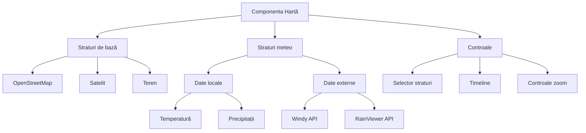

#### Vizualizări 3D pentru parametri meteo

Vizualizările 3D oferă o perspectivă unică asupra datelor meteorologice, permițând identificarea de tipare și corelații care ar fi dificil de observat în reprezentări 2D tradiționale.

Componenta de vizualizare 3D include:

- Reprezentări de tip "val" pentru parametri precum temperatura și presiunea
- Grafice 3D cu bare pentru precipitații și radiație
- Suprafețe 3D pentru reprezentarea distribuției spațiale a parametrilor
- Animații care arată evoluția parametrilor în timp

Implementarea utilizează CSS 3D Transforms și animații, fără a necesita biblioteci 3D complexe, asigurând astfel compatibilitatea și performanța pe diverse dispozitive.

#### Integrare cu servicii meteo externe

Aplicația integrează date din multiple surse externe pentru a completa informațiile locale:

- **Windy.com API**: Modele atmosferice globale, inclusiv predicții
- **RainViewer**: Date radar pentru precipitații în timp real
- **OpenWeatherMap**: Date și prognoze pentru locații din proximitate

Aceste integrări permit:

- Compararea datelor locale cu cele din modele globale
- Vizualizarea tendințelor meteorologice la scară mai largă
- Plasarea condițiilor locale în context regional

### 4.4 Istoric și statistici

#### Vizualizarea și filtrarea datelor istorice

Interfața de istoric oferă utilizatorului control complet asupra vizualizării datelor:

- **Filtre temporale flexibile**: Selectare zi, săptămână, lună, an sau interval personalizat
- **Selecție de parametri**: Posibilitatea de a alege unul sau mai mulți parametri pentru vizualizare
- **Opțiuni de vizualizare**: Tabel de date, grafice liniare, grafice de distribuție, heatmap calendar

Datele sunt încărcate dinamic pe măsură ce utilizatorul ajustează filtrele, folosind paginare și lazy loading pentru a gestiona eficient seturi mari de date.

#### Generarea de rapoarte statistice

Sistemul de statistici oferă informații valoroase derivate din datele brute:

- **Statistici de bază**: Valori minime, maxime, medii, mediane, deviații standard
- **Analiza tendințelor**: Identificarea tendințelor pe termen lung și a anomaliilor
- **Comparații**: Confruntarea datelor curente cu perioade similare din trecut
- **Recorduri**: Evidențierea valorilor record pentru fiecare parametru

Aceste statistici sunt generate automat și pot fi accesate prin interfața aplicației sau exportate în diverse formate.

#### Exportul datelor în diverse formate

Aplicația oferă funcționalități de export al datelor pentru utilizare în alte aplicații sau analize:

- **CSV**: Format tabelar compatibil cu Excel, Google Sheets, etc.
- **JSON**: Format structurat pentru integrare cu alte aplicații
- **PDF**: Rapoarte formatate pentru imprimare și distribuire
- **PNG/JPG**: Export grafice ca imagini

Exporturile pot fi configurate în detaliu, permițând utilizatorului să selecteze:

- Intervalul temporal exact
- Parametrii incluși
- Rezoluția temporală (date brute sau agregate)
- Formatul de dată și separatorii (pentru CSV)

### 4.5 Sistem de autentificare

#### Nivele de acces

Aplicația implementează trei nivele de acces:

- **Anonim**: Acces limitat la date de bază, fără posibilitatea de a vedea istoricul detaliat sau a face modificări
- **Utilizator standard**: Acces complet la vizualizări, istoric și funcționalități de export
- **Administrator**: Toate drepturile utilizatorului standard plus acces la funcționalități administrative

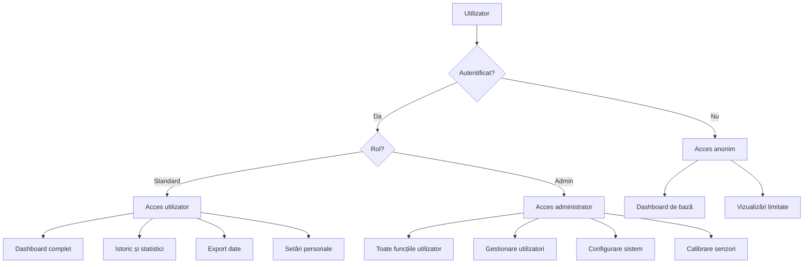

#### Managementul utilizatorilor

Administratorii pot gestiona utilizatorii sistemului prin:

- **Crearea de conturi noi**: Înregistrarea de utilizatori cu diverse roluri
- **Editarea conturilor**: Modificarea datelor utilizatorilor, resetarea parolelor
- **Dezactivarea conturilor**: Suspendarea temporară a accesului
- **Vizualizarea sesiunilor active**: Monitorizarea și închiderea forțată a sesiunilor

Interfața de administrare permite filtrarea și căutarea utilizatorilor, precum și vizualizarea activității recente a acestora.

#### Funcționalități specifice administratorului

Panoul de administrare oferă acces la funcționalități avansate:

- **Monitorizarea sistemului**: Utilizare CPU, memorie, spațiu pe disc
- **Gestionarea bazei de date**: Backup, optimizare, curățare date vechi
- **Calibrarea senzorilor**: Ajustarea offset-urilor și multiplicatorilor pentru precizie
- **Jurnale de sistem**: Vizualizarea log-urilor pentru diagnosticare
- **Configurare avansată**: Ajustarea parametrilor de funcționare a aplicației

Aceste funcționalități sunt accesibile doar utilizatorilor cu rol de administrator, asigurând controlul și securitatea sistemului.

### 4.6 Asistent meteo

#### Interfața conversațională

Asistentul meteo reprezintă o inovație în domeniul stațiilor meteo personale, oferind o interfață conversațională pentru interacțiunea cu datele meteorologice. Acesta permite utilizatorilor să adreseze întrebări în limbaj natural și să primească răspunsuri relevante.

Interfața asistentului este proiectată pentru a fi accesibilă și intuitivă:

- **Chat textual**: Permite formularea de întrebări prin text
- **Interfață vocală** (opțional): Recunoaștere și sinteză vocală pentru interacțiune hands-free
- **Sugestii de întrebări**: Propuneri contextualizate de întrebări pe care utilizatorul le poate adresa

#### Capacitățile de răspuns ale asistentului

Asistentul meteo poate răspunde la o gamă largă de întrebări și comenzi:

- **Informații curente**: "Care este temperatura acum?", "Plouă în acest moment?"
- **Istoric și statistici**: "Care a fost temperatura maximă ieri?", "Cum a evoluat presiunea în ultima săptămână?"
- **Comparații**: "Este mai cald acum decât ieri la aceeași oră?", "Compară umiditatea de azi cu media lunii"
- **Predicții**: "Va ploua mâine?", "Care este tendința presiunii atmosferice?"
- **Explicații**: "De ce scade presiunea atmosferică?", "Ce înseamnă un indice UV de 8?"

Răspunsurile includ nu doar text, ci și elemente vizuale relevante (grafice, indicatori) pentru a ilustra informațiile prezentate.

#### Tehnologiile de inteligență artificială utilizate

Asistentul integrează multiple tehnologii de inteligență artificială:

- **Procesare de limbaj natural (NLP)**: Pentru înțelegerea întrebărilor în limbaj natural
- **Învățare automată**: Pentru personalizarea răspunsurilor în funcție de preferințele utilizatorului
- **Analiza seriilor temporale**: Pentru identificarea tendințelor și modelelor în datele istorice
- **Sisteme bazate pe reguli**: Pentru interogarea precisă a bazei de date și generarea răspunsurilor

## 5. Implementare și detalii tehnice

### 5.1 Configurația hardware și software

#### Detalii despre dispozitivul Raspberry Pi

Aplicația rulează pe un Raspberry Pi 4 Model B, configurat după cum urmează:

- **Procesor**: Broadcom BCM2711, Quad core Cortex-A72 (ARM v8) 64-bit SoC @ 1.5GHz
- **Memorie**: 4GB LPDDR4-3200 SDRAM
- **Stocare**: Card microSD de 64GB clasa 10, UHS-I
- **Sistem de operare**: Raspberry Pi OS (Debian-based) în versiunea 64-bit
- **Conectivitate**: Wi-Fi 2.4 GHz și 5.0 GHz IEEE 802.11ac, Bluetooth 5.0, BLE, Gigabit Ethernet
- **Alimentare**: Sursă de alimentare 5V/3A cu protecție la fluctuații de tensiune

#### Sistem de operare și configurare

Instalarea și configurarea sistemului de operare implică următorii pași:

1. **Instalarea Raspberry Pi OS** folosind Raspberry Pi Imager
2. **Configurare inițială**:
   - Activarea interfețelor SSH, I2C, SPI pentru comunicarea cu senzorii
   - Configurarea rețelei Wi-Fi și setarea unui IP static
   - Actualizarea sistemului (`sudo apt update && sudo apt upgrade`)
3. **Opțimizări**:
   - Dezactivarea interfeței grafice pentru economisirea resurselor (`sudo systemctl set-default multi-user.target`)
   - Configurarea swap-ului pentru performanță optimă
   - Setarea cron job-urilor pentru mentenanță automată

#### Conexiuni și cablaj

Conectarea senzorilor la Raspberry Pi respectă următoarea schemă:

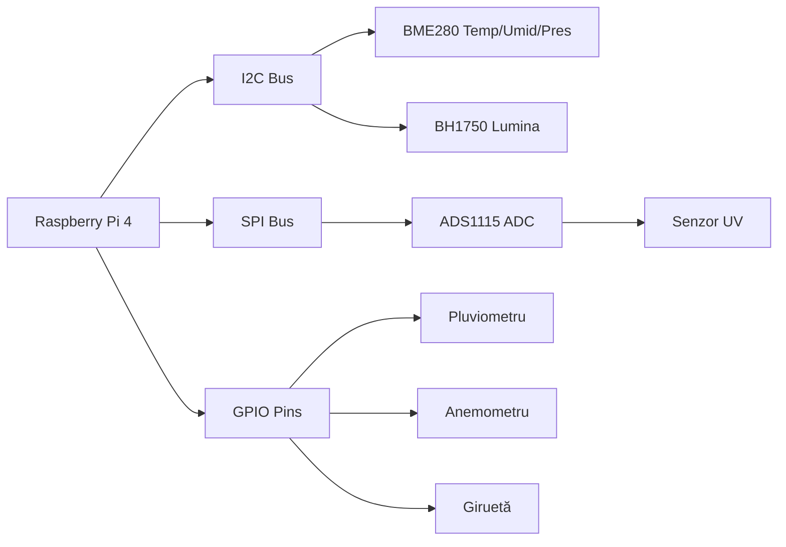

Detalii specifice de cablare pentru fiecare senzor:

- **BME280**: Conectat la pinii SDA (GPIO 2) și SCL (GPIO 3) pentru I2C
- **BH1750**: Conectat la același bus I2C cu adresă diferită
- **ADS1115**: Conectat la I2C pentru conversie analog-digital
- **Pluviometru**: Conectat la GPIO 17 cu rezistor pull-up
- **Anemometru**: Conectat la GPIO 27 pentru măsurarea frecvenței rotației
- **Giruetă**: Conectată la GPIO 22, 23, 24, 25 pentru determinarea direcției

### 5.2 Structura de fișiere și directoare

#### Organizarea backend-ului

Backend-ul este organizat urmând principiile arhitecturii modulare pentru o întreținere și extindere ușoară:

```
backend/
├── app.py                  # Punctul de intrare al aplicației
├── config.py                # Configurații și variabile de mediu
├── requirements.txt        # Dependențe Python
├── database/
│   ├── models.py            # Definițiile modelelor SQLAlchemy
│   ├── db.py                # Funcții de gestionare a bazei de date
│   └── migrations/           # Migrarea schemei bazei de date
├── api/
│   ├── routes.py             # Definirea rutelor API
│   ├── sensors.py            # Procesarea datelor de la senzori
│   ├── weather.py            # Logică specifică meteo
│   └── auth.py               # Autentificare și autorizație
├── utils/
│   ├── validators.py         # Validatori de date
│   ├── conversions.py        # Funcții de conversie a unităților
│   └── logging.py            # Configurare logging
├── scripts/
│   ├── sensor_simulator.py    # Script pentru simularea senzorilor
│   └── maintenance.py        # Script de mentenanță
└── tests/                    # Teste unitare și de integrare
```

#### Organizarea frontend-ului

Frontend-ul este structurat conform principiilor React moderne, cu o abordare bazată pe componente:

```
frontend/
├── public/                  # Fișiere statice și index.html
├── src/
│   ├── index.js              # Punctul de intrare al aplicației React
│   ├── App.js                # Componenta principală
│   ├── components/            # Componente React reutilizabile
│   │   ├── Dashboard/
│   │   ├── Charts/
│   │   ├── Maps/
│   │   ├── WeatherDisplay/
│   │   └── UI/
│   ├── pages/                 # Pagini/rute React
│   ├── hooks/                 # Custom React hooks
│   ├── api/                   # Servicii pentru apeluri API
│   ├── utils/                 # Funcții utilitate
│   ├── context/               # Context API și state management
│   └── assets/                # Imagini, fonturi, CSS/SCSS
├── package.json             # Dependențe npm și script-uri
└── .env                     # Variabile de mediu pentru dezvoltare
```

### 5.3 Detalii de implementare backend

#### Structura modelelor de date

Modelele de date sunt definite folosind SQLAlchemy ORM, oferind o abstractizare peste baza de date SQLite:

```python
from sqlalchemy import Column, Integer, Float, String, DateTime, ForeignKey
from sqlalchemy.ext.declarative import declarative_base
from datetime import datetime

Base = declarative_base()

class WeatherData(Base):
    __tablename__ = 'weather_data'
    
    id = Column(Integer, primary_key=True)
    timestamp = Column(DateTime, default=datetime.utcnow, index=True)
    temperature = Column(Float)
    humidity = Column(Float)
    pressure = Column(Float)
    wind_speed = Column(Float)
    wind_direction = Column(String(3))  # N, NE, E, etc.
    light_level = Column(Float)
    uv_index = Column(Float)
    rainfall = Column(Float)  # Cantitate de precipitații în mm
    
    def to_dict(self):
        return {
            'id': self.id,
            'timestamp': self.timestamp.isoformat(),
            'temperature': self.temperature,
            'humidity': self.humidity,
            'pressure': self.pressure,
            'wind_speed': self.wind_speed,
            'wind_direction': self.wind_direction,
            'light_level': self.light_level,
            'uv_index': self.uv_index,
            'rainfall': self.rainfall
        }

class User(Base):
    __tablename__ = 'users'
    
    id = Column(Integer, primary_key=True)
    username = Column(String(80), unique=True, nullable=False)
    email = Column(String(120), unique=True, nullable=False)
    password_hash = Column(String(256), nullable=False)
    role = Column(String(20), default='user')  # 'user' sau 'admin'
    
    # Metode pentru gestionarea parolelor, autentificare, etc.
```

#### API endpoints

API-ul RESTful este implementat folosind Flask și Blueprint-uri pentru o organizare modulară:

```python
from flask import Blueprint, request, jsonify
from database.models import WeatherData
from database.db import get_session
from datetime import datetime, timedelta

weather_api = Blueprint('weather_api', __name__)

@weather_api.route('/current', methods=['GET'])
def get_current_weather():
    """Returnează datele meteorologice curente."""
    session = get_session()
    latest_data = session.query(WeatherData).order_by(WeatherData.timestamp.desc()).first()
    session.close()
    
    if not latest_data:
        return jsonify({'error': 'No weather data available'}), 404
        
    return jsonify(latest_data.to_dict())

@weather_api.route('/history', methods=['GET'])
def get_weather_history():
    """Returnează istoricul datelor meteorologice cu filtrare."""
    session = get_session()
    
    # Parametri de filtrare
    start_date = request.args.get('start', None)
    end_date = request.args.get('end', None)
    param = request.args.get('param', None)  # temperatura, umiditate, etc.
    
    # Construire query
    query = session.query(WeatherData)
    
    if start_date:
        start_date = datetime.fromisoformat(start_date)
        query = query.filter(WeatherData.timestamp >= start_date)
        
    if end_date:
        end_date = datetime.fromisoformat(end_date)
        query = query.filter(WeatherData.timestamp <= end_date)
    
    # Limitare la ultimele 1000 de înregistrări dacă nu sunt specificate date
    if not start_date and not end_date:
        query = query.order_by(WeatherData.timestamp.desc()).limit(1000)
    else:
        query = query.order_by(WeatherData.timestamp.asc())
    
    data = query.all()
    session.close()
    
    # Selectare doar parametrul dorit dacă e specificat
    result = [entry.to_dict() for entry in data]
    if param and data:
        result = [{'timestamp': entry['timestamp'], param: entry.get(param)} for entry in result if param in entry]
    
    return jsonify(result)

@weather_api.route('/data', methods=['POST'])
def add_weather_data():
    """Adaugă noi date meteorologice primite de la senzori."""
    data = request.get_json()
    
    # Validare date
    required_fields = ['temperature', 'humidity', 'pressure']
    for field in required_fields:
        if field not in data:
            return jsonify({'error': f'Missing required field: {field}'}), 400
    
    # Creare înregistrare în baza de date
    session = get_session()
    new_data = WeatherData(
        temperature=data.get('temperature'),
        humidity=data.get('humidity'),
        pressure=data.get('pressure'),
        wind_speed=data.get('wind_speed'),
        wind_direction=data.get('wind_direction'),
        light_level=data.get('light_level'),
        uv_index=data.get('uv_index'),
        rainfall=data.get('rainfall')
    )
    
    session.add(new_data)
    session.commit()
    session.close()
    
    return jsonify({'success': True, 'id': new_data.id}), 201
```

#### Logică de procesare a datelor

Procesarea datelor include validare, filtrare de outlieri și agregații statistice:

```python
def calculate_statistics(data, parameter):
    """Calculează statistici pentru un parametru meteorologic."""
    if not data or not parameter:
        return None
        
    values = [entry.get(parameter) for entry in data if entry.get(parameter) is not None]
    
    if not values:
        return None
        
    return {
        'min': min(values),
        'max': max(values),
        'avg': sum(values) / len(values),
        'median': sorted(values)[len(values) // 2],
        'count': len(values)
    }

def detect_anomalies(data, parameter, window_size=5, threshold=2.0):
    """Detectează anomalii folosind media mobilă și deviația standard."""
    values = [entry.get(parameter) for entry in data if entry.get(parameter) is not None]
    timestamps = [entry.get('timestamp') for entry in data if entry.get(parameter) is not None]
    
    if len(values) < window_size * 2:
        return []  # Prea puține date pentru detecție
        
    anomalies = []
    
    for i in range(window_size, len(values) - window_size):
        # Fereastra înainte și după punctul curent
        window_before = values[i-window_size:i]
        window_after = values[i+1:i+window_size+1]
        
        # Calcul medie și deviație standard pentru fereastra de context
        context_values = window_before + window_after
        mean = sum(context_values) / len(context_values)
        std_dev = (sum((x - mean) ** 2 for x in context_values) / len(context_values)) ** 0.5
        
        # Verificare dacă valoarea curentă se abate semnificativ
        if std_dev > 0 and abs(values[i] - mean) > threshold * std_dev:
            anomalies.append({
                'timestamp': timestamps[i],
                'value': values[i],
                'expected': mean,
                'deviation': abs(values[i] - mean) / std_dev
            })
    
    return anomalies
```

### 5.4 Detalii de implementare frontend

#### Arhitectura componentelor React

Arhitectura frontend-ului urmează principiile moderne de dezvoltare React, folosind hooks și context pentru state management:

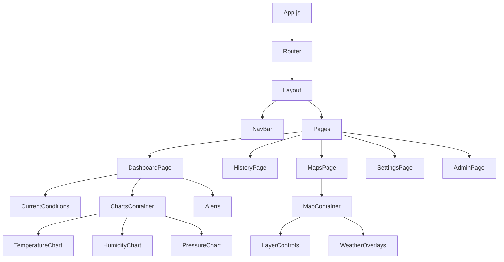

Principiile cheie ale arhitecturii includ:

- **Separarea responsabilităților**: Fiecare componentă are un scop bine definit
- **Compoziția** în loc de moștenire: Componentele sunt compuse din componente mai mici
- **Reutilizabilitatea**: Componente comune sunt partajate între părțile aplicației
- **Izolarea stării**: Starea este gestionată la nivelul adecvat de izolare

#### Managementul stării aplicației

Aplicația utilizează o combinație de abordări pentru gestionarea stării:

- **React Context API** pentru starea globală (temă, autentificare, preferințe utilizator)
- **React Query** pentru starea derivată din server, cu caching și invalidare inteligentă
- **React useState/useReducer** pentru starea locală a componentelor

Exemplu de context pentru tema aplicației:

```jsx
import { createContext, useState, useContext, useEffect } from 'react';

const ThemeContext = createContext();

export function ThemeProvider({ children }) {
  // Inițializăm tema din localStorage sau folosim valoarea implicită
  const [isDarkMode, setIsDarkMode] = useState(() => {
    const savedTheme = localStorage.getItem('theme');
    return savedTheme === 'dark' || (!savedTheme && window.matchMedia('(prefers-color-scheme: dark)').matches);
  });
  
  // Funcție pentru comutarea temei
  const toggleTheme = () => {
    setIsDarkMode(prev => !prev);
  };
  
  // Efectul pentru salvarea preferintței în localStorage
  useEffect(() => {
    localStorage.setItem('theme', isDarkMode ? 'dark' : 'light');
    // Aplicăm tema la nivel de document
    document.documentElement.setAttribute('data-theme', isDarkMode ? 'dark' : 'light');
  }, [isDarkMode]);
  
  return (
    <ThemeContext.Provider value={{ isDarkMode, toggleTheme }}>
      {children}
    </ThemeContext.Provider>
  );
}

// Hook personalizat pentru utilizarea contextului de temă
export function useTheme() {
  return useContext(ThemeContext);
}
```

#### Comunicarea cu API-ul backend

Comunicarea cu backend-ul este gestionată prin servicii dedicate care encapsulează logica de apelare a API-ului:

```jsx
import axios from 'axios';

const weatherApi = axios.create({
  baseURL: process.env.REACT_APP_API_URL || 'http://localhost:5000/api',
  timeout: 10000,
  headers: {
    'Content-Type': 'application/json'
  }
});

// Interceptor pentru adăugarea token-ului de autentificare
weatherApi.interceptors.request.use(config => {
  const token = localStorage.getItem('token');
  if (token) {
    config.headers.Authorization = `Bearer ${token}`;
  }
  return config;
});

// Funcții pentru apelarea endpoint-urilor API
export const fetchCurrentWeather = async () => {
  const response = await weatherApi.get('/weather/current');
  return response.data;
};

export const fetchWeatherHistory = async (params) => {
  const response = await weatherApi.get('/weather/history', { params });
  return response.data;
};

export const fetchStatistics = async (parameter, startDate, endDate) => {
  const response = await weatherApi.get('/weather/statistics', {
    params: { parameter, start: startDate, end: endDate }
  });
  return response.data;
};
```

#### Componente de vizualizare avansate

Implementarea vizualizărilor avansate, precum hărțile interactive și vizualizările 3D, utilizează diverse biblioteci optimizate pentru performanță și UX:

```jsx
import { useEffect, useRef } from 'react';
import { useWeatherData } from '../hooks/useWeatherData';
import { useTheme } from '../context/ThemeContext';

function WeatherMap3D() {
  const mapContainer = useRef(null);
  const { currentData, historicalData } = useWeatherData();
  const { isDarkMode } = useTheme();
  
  useEffect(() => {
    if (!mapContainer.current || !historicalData) return;
    
    // Configurare vizualizare 3D cu CSS Transforms
    const container = mapContainer.current;
    const dataPoints = historicalData.map(item => ({
      x: new Date(item.timestamp).getHours(),
      y: new Date(item.timestamp).getDate() % 7,
      z: item.temperature,
      color: getTemperatureColor(item.temperature)
    }));
    
    // Curățăm containerul
    container.innerHTML = '';
    
    // Creăm elementele 3D
    dataPoints.forEach(point => {
      const element = document.createElement('div');
      element.className = 'data-point';
      element.style.left = `${point.x * 30}px`;
      element.style.top = `${point.y * 30}px`;
      element.style.transform = `translateZ(${point.z * 3}px)`;
      element.style.backgroundColor = point.color;
      element.setAttribute('data-value', point.z.toFixed(1));
      container.appendChild(element);
    });
    
    // Adăugăm manipulare pentru rotire cu mouse/touch
    // ...
    
  }, [historicalData, isDarkMode]);
  
  // Funcție helper pentru calculul culorii în funcție de temperatură
  function getTemperatureColor(temp) {
    // Gradient de culoare de la albastru (rece) la roșu (cald)
    if (temp < 0) return '#0022FF';
    if (temp > 35) return '#FF0000';
    
    // Interpolare pentru valori intermediare
    const ratio = temp / 35;
    const r = Math.floor(255 * ratio);
    const b = Math.floor(255 * (1 - ratio));
    return `rgb(${r}, 60, ${b})`;
  }
  
  return (
    <div className="weather-map-3d-container">
      <h3>Vizualizare 3D - Temperatura</h3>
      <div className="map-controls">
        {/* Controale pentru rotire, zoom, etc. */}
      </div>
      <div ref={mapContainer} className="map-container"></div>
      <div className="legend">
        {/* Legendă pentru culori */}
      </div>
    </div>
  );
}
```

#### Responsivitate și accesibilitate

Aplicația este proiectată pentru a fi complet responsivă și accesibilă, utilizând:

- **CSS Grid și Flexbox** pentru layout-uri adaptive
- **Media queries** pentru ajustarea interfeței pe diverse dispozitive
- **Biblioteca Chakra UI** pentru componente accesibile
- **Semantic HTML** pentru structură adecvată și suport pentru cititoare de ecran
- **Focus management** pentru navigație via tastatură

Exemplu de componentă responsivă:

```jsx
import { Box, Grid, useBreakpointValue } from '@chakra-ui/react';

function DashboardGrid({ children }) {
  // Ajustăm numărul de coloane în funcție de dimensiunea ecranului
  const columns = useBreakpointValue({ base: 1, md: 2, lg: 3, xl: 4 });
  
  return (
    <Grid
      templateColumns={`repeat(${columns}, 1fr)`}
      gap={4}
      p={4}
      width="100%"
    >
      {children}
    </Grid>
  );
}
```

### 5.5 Securitate și performanță

#### Măsuri de securitate implementate

Aplicația integrează multiple măsuri de securitate pentru a proteja datele și sistemul:

- **Autentificare securizată**: Parole hash-uite cu bcrypt și JWT pentru sessions
- **Validarea input-urilor**: Verificare strictă a tuturor datelor primite de la utilizatori
- **Rate limiting**: Limitarea numărului de cereri pentru a preveni atacurile
- **CORS configurat**: Restricționarea originilor permise pentru cereri
- **Headers de securitate**: X-Content-Type-Options, X-Frame-Options, Content-Security-Policy
- **Auditare**: Logging-ul tuturor operațiunilor sensibile

Exemplu de implementare rate limiting în Flask:

```python
from flask import Flask
from flask_limiter import Limiter
from flask_limiter.util import get_remote_address

app = Flask(__name__)
limiter = Limiter(
    app,
    key_func=get_remote_address,
    default_limits=["200 per day", "50 per hour"]
)

@app.route('/api/login', methods=['POST'])
@limiter.limit("5 per minute")
def login():
    # Implementarea login-ului
    pass
```

#### Optimizări de performanță

Performanța aplicației este optimizată prin diverse tehnici:

- **Lazy loading** pentru componente și date
- **Memorizare** pentru calcule costisitoare
- **Paginare** pentru seturi mari de date
- **Bundle splitting** pentru reducerea dimensiunii pachetelor JavaScript
- **Compression middleware** pentru reducerea traficului de rețea
- **Strategii de caching** pentru date statice și semi-dinamice

Exemplu de implementare lazy loading în React:

```jsx
import { lazy, Suspense } from 'react';
import { Routes, Route } from 'react-router-dom';
import LoadingSpinner from './components/UI/LoadingSpinner';

// Lazy loading pentru pagini
const Dashboard = lazy(() => import('./pages/Dashboard'));
const HistoryPage = lazy(() => import('./pages/HistoryPage'));
const MapPage = lazy(() => import('./pages/MapPage'));
const SettingsPage = lazy(() => import('./pages/SettingsPage'));

function App() {
  return (
    <Suspense fallback={<LoadingSpinner />}>
      <Routes>
        <Route path="/" element={<Dashboard />} />
        <Route path="/history" element={<HistoryPage />} />
        <Route path="/map" element={<MapPage />} />
        <Route path="/settings" element={<SettingsPage />} />
      </Routes>
    </Suspense>
  );
}
```

#### Scalabilitate și fiabilitate

Sistemul este proiectat pentru a fi scalabil și fiabil chiar și în condiții de utilizare intensă:

- **Arhitectură modulară** care permite scalarea pe componente
- **Queue system** pentru operațiuni de durată lungă (export, rapoarte)
- **Circuit breakers** pentru a preveni cascadarea eșecurilor
- **Backup automat** pentru baza de date
- **Mecanisme de recuperare** în caz de eșec

## 6. Concluzii și perspective

### 6.1 Rezumatul proiectului

Proiectul Stație Meteo reprezintă o soluție completă pentru monitorizarea, analiza și vizualizarea parametrilor meteorologici, integrând hardware de calitate cu software modern. Principalele realizări ale proiectului includ:

- Dezvoltarea unei platforme complete client-server pentru colectarea și analiza datelor meteorologice
- Implementarea unei interfețe intuitive și atractive pentru vizualizarea datelor în timp real
- Integrarea unor vizualizări avansate precum hărți interactive și reprezentări 3D
- Funcționalități de analiză a datelor istorice și generare de statistici
- Asistentul meteo bazat pe inteligență artificială pentru interacțiune conversațională

Proiectul demonstrează cum tehnologii moderne precum React, Flask, SQLAlchemy și hardware de tip Raspberry Pi pot fi combinate pentru a crea o aplicație IoT performantă și accesibilă.

### 6.2 Limitări actuale

Deși proiectul implementează cu succes un sistem funcțional complet, există câteva limitări actuale:

- **Scalabilitate limitată**: Baza de date SQLite poate deveni o constrângere pentru stocarea pe termen foarte lung
- **Predicții bazate pe modele simple**: Capacitățile de prognoză sunt limitate la analiză de bază a tendințelor
- **Consum energetic**: Funcționarea continuă a Raspberry Pi necesită o sursă stabilă de energie
- **Acuratețe dependentă de calitatea senzorilor**: Precizia datelor este limitată de specificatțiile hardware-ului utilizat

### 6.3 Dezvoltări viitoare

Proiectul poate fi extins în viitor prin diverse îmbunătățiri și funcționalități noi:

- **Migrație la o bază de date scalabilă**: Trecerea la PostgreSQL sau MongoDB pentru seturi de date mai mari
- **Implementarea machine learning**: Modele avansate pentru predicții meteo personalizate și detecția anomaliilor
- **Extinderea rețelei de senzori**: Adăugarea de senzori multiple pentru acoperire geografică mai largă
- **Integrare cu platforme smart home**: Conectare cu sisteme precum Home Assistant sau SmartThings
- **Aplicație mobilă nativă**: Dezvoltarea de aplicații native pentru iOS și Android
- **Funcționalități sociale**: Partajare și comparare a datelor cu alți utilizatori în apropiere

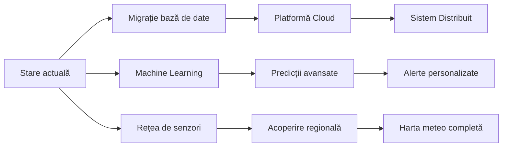

### 6.4 Impactul proiectului

Proiectul Stație Meteo are potențialul de a genera impact în diverse domenii:

- **Educație**: Instrument pentru învățarea fenomenelor meteorologice și analiza datelor
- **Agricultură**: Monitorizare microclima și asistare a deciziilor bazate pe condiții meteo
- **Cercetare amatoră**: Facilitarea participării cetățenilor în colectarea de date climatice
- **Smart Home**: Integrare cu sisteme de irigație, climatizare și alte dispozitive conectate

Prin combinația de hardware accesibil și software modern, proiectul democratizează accesul la tehnologii de monitorizare meteo, anterior disponibile doar instituțiilor specializate.

## 7. Referințe bibliografice

### 7.1 Resurse tehnice

- Flask Documentation: https://flask.palletsprojects.com/
- React Documentation: https://reactjs.org/docs/getting-started.html
- SQLAlchemy Documentation: https://docs.sqlalchemy.org/
- Raspberry Pi Documentation: https://www.raspberrypi.org/documentation/
- Chart.js Documentation: https://www.chartjs.org/docs/
- Leaflet Documentation: https://leafletjs.com/reference.html
- Chakra UI Documentation: https://chakra-ui.com/docs/getting-started

### 7.2 Resurse meteo și IoT

- World Meteorological Organization Standards: https://public.wmo.int/en
- OpenWeatherMap API Documentation: https://openweathermap.org/api
- Windy API Documentation: https://api.windy.com/
- BME280 Sensor Datasheet: https://www.bosch-sensortec.com/products/environmental-sensors/humidity-sensors-bme280/
- ADS1115 ADC Datasheet: https://www.ti.com/product/ADS1115

### 7.3 Articole și publicații

- Bell, S. et al. (2015). "Low-cost sensors for the measurement of atmospheric composition", World Meteorological Organization
- Smith, J. et al. (2019). "IoT-based Weather Monitoring Systems: A Review", Journal of Atmospheric and Oceanic Technology
- Chen, L. et al. (2018). "Applications of Internet of Things in Meteorological Monitoring", IEEE Internet of Things Journal
- Garcia, M. et al. (2020). "Web-based Visualization Techniques for Weather Data: A Comparative Study", Journal of Visualization